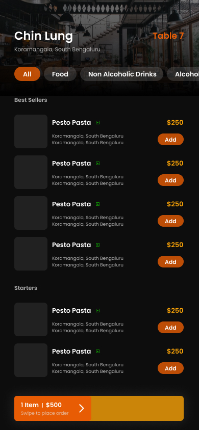

<h1 style="color:red;" >Note: Login credentials for app -> Phone: 1234567890, Password: qwerty</h1>

Enjoy a hassle free dining experience with our virtual menu and contactless payment.

## Tech we used to make this app:

- Wireframing: figma
- Backend: NodeJS, Express
- Database: MongoDB
- Frontend: NextJS
- Appdev: ReactNative

## Some screenshots to get you acquainted:

      
   
   
   
   
   

## How to order:

1. After logging in, open the scanner and scan the qr code provided at the table by the restaurant.
2. After scanning, you will be presented with a menu where you can add items to your cart.
3. Once you have decided what you want to eat, just click on confirm cart and the restaurant will recieve your order.
4. After you're done eating, you'll get a payment screen where you'll be presented with the bill, which contains the dishes you ordered and the final amount payable after taxes.
5. After you make the payment you're set.

app - https://drive.google.com/file/d/1TkS_6KbiQJ-NeKQMsXk6JynI73vl8ppM/view?usp=sharing
web -  https://guacamol-web-adityamhn.vercel.app/62a5106f0043756d72053395/62a51215cebbc550c3774580,   
api -  http://ec2-3-108-235-208.ap-south-1.compute.amazonaws.com:8010,  
figma - [https://www.figma.com/file/nKB9R0Gb2I9fLo8dNQv8kW/Jolteon?node-id=0%3A1 ](https://www.figma.com/file/nKB9R0Gb2I9fLo8dNQv8kW/Guacamole?node-id=0%3A1)
